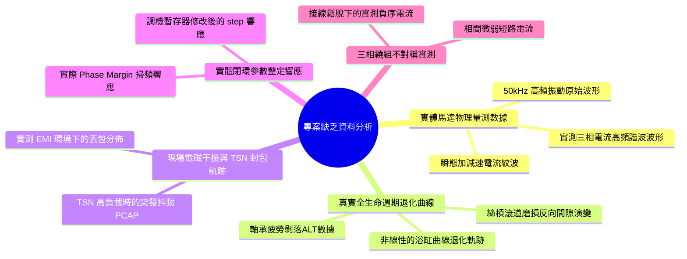
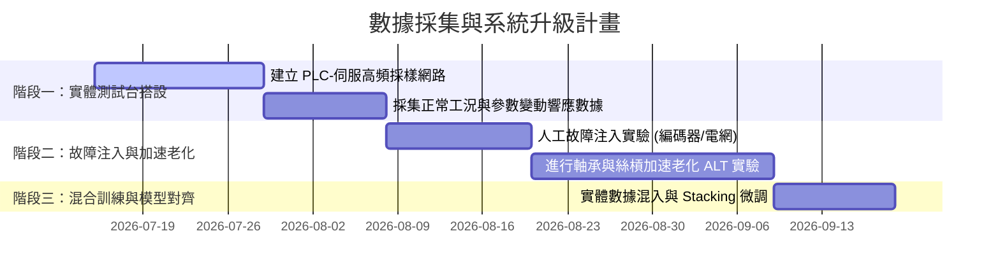

# AI Servo 馬達健康管理專案資料落差與缺乏資料分析報告
**工業 AI 系統數據完備性評估**

---

## 壹、 專案資料現狀評估

當前專案已建立了一套高度完整的**「模擬資料生成、AutoML 分類、時序預估、物理增益優化及 SLMP 閉環寫入與回滾」**技術驗證平台。

> [!NOTE]
> 目前專案中用於模型訓練及驗證的數據（例如 `streaming_data.parquet`）主要源自於統計模擬生成器（實作於 [phm_pipeline.py](file:///d:/20260713/20260707-馬達專題-V4/02_專案實作與驗證/AI_SERVO_V5_PART_5_SCENARIOS_25_30/phm_pipeline.py) 中的 `generate_scenario_data`）。
> 雖然該模擬數據能有效驗證軟體架構、卡爾曼濾波、自適應超參數尋優及安全機制的可行性，但若要部署於真實產線，系統仍面臨**關鍵實體數據缺乏與物理落差**的嚴峻挑戰。

---

## 貳、 缺乏的核心資料類別

經過對專案代碼、物理特徵工程及模型判定邏輯的深度分析，系統目前缺乏以下五類關鍵實體資料：

### 1. 實體馬達物理量測高頻原始數據 (High-Frequency Raw Sensor Waveforms)
*   **現狀**：頻域與振動特徵（如 `vibration_rms_g`、`resonance_frequency_hz`、`bearing_bpfo_amp`、`fft_1x_amp`）是由統計分佈直接生成的**特徵指標值**，而非高頻時域波形。
*   **缺乏**：
    *   **高頻加速度規原始波形 (20kHz ~ 50kHz)**：用於驗證特徵工程中 envelope 解調、小波變換等算法在現場複雜噪訊下的特徵提取精度。
    *   **三相電流高頻採樣波形**：現場變頻器高頻載波產生的電流諧波數據，這對於精準提取 `current_unbalance_pct` 及早期繞組短路特徵至關重要。

### 2. 真實全生命週期退化數據 (Real Run-to-Failure Lifetime Curves)
*   **現狀**：Scenario 30 (漸進式失效) 的健康度是透過線性時間因子簡化模擬的：
    $$H_w(t) = 90.0 - 75.0 \cdot t_{\text{factor}} + \text{Noise}$$
*   **缺乏**：
    *   **加速老化實驗 (Accelerated Life Testing, ALT) 數據**：滾珠螺桿滾道剥落、馬達軸承保持架碎裂的真實 Run-to-Failure 全生命週期連續監測數據。真實的磨損退化具有顯著的非線性（如浴缸曲線的突變退化），線性模擬無法驗證 LSTM/BiGRU 預測剩餘壽命 (RUL) 的晚期突變泛化能力。

### 3. 真實工業現場網路電磁干擾與封包丟失軌跡 (Real Network Packets under EMI/Load Stress)
*   **現狀**：`network_jitter_ms` 與 `ethercat_packet_loss_pct` 均是獨立同分佈 (i.i.d.) 的正態隨機噪訊。
*   **缺乏**：
    *   **實測工業乙太網抓包文件 (PCAP)**：現場大功率馬達啟停、電弧銲接等強電磁干擾 (EMI) 下的實測丟包軌跡。真實的通訊丟包往往呈**群聚性 (Clustered/Burst)** 發生，與隨機均勻分佈截然不同，這會嚴重影響防抖過濾器 (Anti-Chatter Filter) 的窗口寬度設計。

### 4. 實體閉環參數整定之暫態響應數據 (Real Closed-Loop Tuning Transient Feedbacks)
*   **現狀**：當優化器寫入三菱 MR-J5 暫存器（如寫入 `PA08` 位置增益、`PB15` 陷波頻率）後，其對應的優化 KPI（如定位時間、殘餘震動衰減）是直接在腳本中設定的模擬反饋。
*   **缺乏**：
    *   **真實伺服步階響應曲線**：寫入不同增益參數後，編碼器回授的位置與速度暫態曲線（超調量、上升時間、整定時間）。這對於建立增益自動整定演算法與相位裕度安全鎖的物理回饋迴路是不可或缺的。

### 5. 三相繞組不對稱與電網波動實測數據 (Phase Asymmetry & Grid Instability Data)
*   **現狀**：Scenario 21 (電網電源波動) 與 Scenario 22 (欠壓跌落) 僅以數學比例模擬不平衡率與電壓。
*   **缺乏**：
    *   實體電網晃電、三相不平衡、繞組匝間局部微弱短路引起的實測負序與正序電流比率，這能防止 AI 軟感測器在複雜高載工作狀態下將普通負載波動誤判為電網故障。

---

## 參、 資料落差對模型性能的潛在影響

這些資料的缺乏可能導致模型在現場部署時產生以下嚴重問題：

| 潛在影響 (Potential Impact) | 物理機制與原因 (Root Cause) | 風險評估 |
| :--- | :--- | :---: |
| **門檻規則失效與假報警** | 真實現場噪訊具有重尾分佈 (Heavy-tailed) 及動態隨機漂移，當前基於硬性臨界值（如 `current_unbalance_pct > 3.0`）的診斷規則在面對真實漂移時會觸發大面積誤報。 | **High** |
| **LO 早期退化漏判** | 真實 LO 的特徵比模擬數據更加微弱且容易被背景機械噪訊淹沒。過度乾淨的模擬特徵會使 AutoML / 深度學習模型在現場的召回率顯著下降。 | **Critical** |
| **控制失穩或安全鎖過敏** | 相位裕度估算算法在沒有實體頻響曲線驗證下，可能會因為高頻雜訊估算不準，導致安全鎖「過度敏感」（頻繁中斷調機）或「過度遲鈍」（引發高頻共振）。 | **High** |
| **RUL 預估時間嚴重偏差** | 因缺乏 ALT 實驗中的部件非線性老化拐點資料，模型無法精準定位從「穩定運轉」轉變為「快速失效」臨界時間點，容易錯失維護窗口。 | **Medium** |

---

## 肆、 數據補齊與實體驗證行動方針建議

為了解決上述資料缺乏問題，建議實施以下三階段數據採集計畫：

### 階段一：搭設實體伺服數據採樣與調機測試台 (建置實體基線)
1.  **高頻採樣通道配置**：
    - 使用三菱電機的高速數據採集模組或邊緣端工業 IPC，通過 CC-Link IE TSN 以 **1000Hz (1ms)** 同步採集 121 個 Tags，並建立 real-world 基線資料庫。
2.  **調機暫態響應採集**：
    - 撰寫自動化測試腳本，使馬達在不同增益參數下執行往返定位動作，記錄並儲存位置追隨誤差之時間序列，作為「增益-效能」映射的真實訓練樣本。

### 階段二：人工故障注入與加速退化實驗 (ALT)
1.  **電氣與網路人工故障注入**：
    - 在安全受控環境下，手動引入三相電源不平衡、在網路中注入 TSN 封包延遲，採集 Scenario 21-24 的真實反應特徵。
2.  **軸承加速老化 ALT**：
    - 搭建專用疲勞測試台，對被測馬達施加額外徑向過載負載，使其持續高速運轉，直至軸承發生剝落，採集全生命週期的高頻振動與溫度數據，以標定 RUL (剩餘壽命) 模型的非線性衰退拐點。

### 階段三：物理特徵解調與模型混合訓練
1.  **導入實體信號解調算法**：
    - 將實測的高頻振動信號導入 `dsp_analytics.py`，通過帶通濾波及希爾伯特變換 (Hilbert Transform) 進行解調，計算實體 BPFO 與 BPFI 振幅，取代模擬數值。
2.  **遷移學習與 Domain Adaptation**：
    - 將收集到的真實工業數據（Real Domain）與現有的模擬數據（Synthetic Domain）混合，使用對抗性遷移學習（Domain Adversarial Training），使分類器能適應真實現場的物理噪訊分佈，徹底打通 AI PHM 系統落地的最後一哩路。
