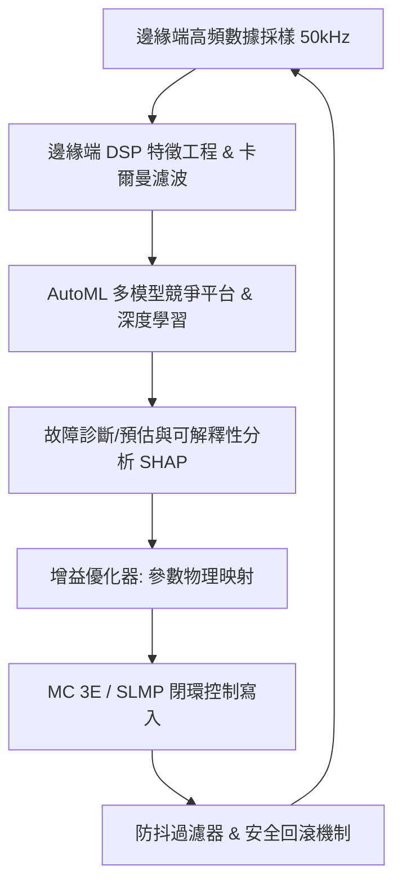

# 基於工業物聯網與人工智慧之伺服馬達預測性維護與閉環控制參數優化系統研究
## 專案報告 (供網頁版 Gemini 快速對接使用)

---

## 壹、 專案基本資訊與背景

本專案研發一套**「AI 伺服健康管理 (PHM) 與自適應參數優化閉環控制系統」**，主要針對工業自動化產線的核心驅動單元——伺服馬達系統（特別是**三菱電機 MR-J5 伺服驅動器**及 **CC-Link IE TSN/EtherCAT 網路協定**）進行研發。

### 核心技術鏈路

---

## 貳、 專案目錄與模組結構

以下是專案的實體程式碼結構與核心模組定義：

*   **邊緣端數據處理與特徵工程**
    *   [dsp_analytics.py](file:///d:/20260713/20260707-馬達專題-V4/02_專案實作與驗證/AI_SERVO_V5_PART_5_SCENARIOS_25_30/dsp_analytics.py)：實作二維卡爾曼濾波、快速傅立葉變換 (FFT)、共振峰分析、長時溫升預測 (ARIMA)。
    *   [phm_soft_sensors.py](file:///d:/20260713/20260707-馬達專題-V4/02_專案實作與驗證/AI_SERVO_V5_PART_5_SCENARIOS_25_30/phm_soft_sensors.py)：實作物理量數值微分（速度、加速度、Jerk）、三相電流對稱分量解算（正序、負序、零序分量）、AI 轉矩虛擬感測器、以及稀疏位置重構。
    *   [data_augmentation.py](file:///d:/20260713/20260707-馬達專題-V4/02_專案實作與驗證/AI_SERVO_V5_PART_5_SCENARIOS_25_30/data_augmentation.py)：時域高階無量綱特徵（峭度、波峰因數、裕度因數）解算，動態高斯雜訊注入與物理振幅微調數據增強。
*   **機器學習、深度學習與優化核心**
    *   [ml_automl_engine.py](file:///d:/20260713/20260707-馬達專題-V4/02_專案實作與驗證/AI_SERVO_V5_PART_5_SCENARIOS_25_30/ml_automl_engine.py)：AutoML 競爭平台、元學習 Stacking 分類/回歸器、無監督多模型聚類、自研貝氏超參優化器、遺傳演算法尋優器。
    *   [deep_learning_models.py](file:///d:/20260713/20260707-馬達專題-V4/02_專案實作與驗證/AI_SERVO_V5_PART_5_SCENARIOS_25_30/deep_learning_models.py)：NumPyMLP、NumPyLSTM、雙向 GRU + 自注意力機制、以及自研動態計算圖自動微分引擎。
    *   [performance_optimizer.py](file:///d:/20260713/20260707-馬達專題-V4/02_專案實作與驗證/AI_SERVO_V5_PART_5_SCENARIOS_25_30/performance_optimizer.py)：伺服控制增益（極點配置自動整定）、摩擦力與反向間隙物理參數映射、OT 寫入 Payload 資安安全簽章（CRC-32 & SHA-256 Checksum）。
*   **通訊與安全控制閉環**
    *   [slmp_client.py](file:///d:/20260713/20260707-馬達專題-V4/02_專案實作與驗證/AI_SERVO_V5_PART_5_SCENARIOS_25_30/slmp_client.py)：基於 MC 3E 二進位幀格式的 TCP 用戶端，支援多軸 Station No 與 Network ID TSN 路由。
    *   [mr_configurator2_workflow_engine.py](file:///d:/20260713/20260707-馬達專題-V4/02_專案實作與驗證/AI_SERVO_V5_PART_5_SCENARIOS_25_30/mr_configurator2_workflow_engine.py)：模擬三菱伺服主動調試調機工作流，實作相位裕度穩定性安全鎖、CRC/SHA 資安安全密碼閘門。
    *   [test_slmp_closed_loop.py](file:///d:/20260713/20260707-馬達專題-V4/02_專案實作與驗證/AI_SERVO_V5_PART_5_SCENARIOS_25_30/test_slmp_closed_loop.py)：閉環通訊與安全回滾（急停鎖死 + 備份寫入）聯調驗證腳本。
*   **戰略調配與數據管線**
    *   [phm_pipeline.py](file:///d:/20260713/20260707-馬達專題-V4/02_專案實作與驗證/AI_SERVO_V5_PART_5_SCENARIOS_25_30/phm_pipeline.py)：六階段工業 AI 與 TSN 閉環控制架構主控程序。包含 Parquet Schema 精確型別壓縮與 Isolation Forest 無監督新奇檢測（未知異常檢測）。
    *   [data_analysis.py](file:///d:/20260713/20260707-馬達專題-V4/02_專案實作與驗證/AI_SERVO_V5_PART_5_SCENARIOS_25_30/data_analysis.py) & [data_analysis_dashboard.py](file:///d:/20260713/20260707-馬達專題-V4/data_analysis_dashboard.py)：步階響應時域分析與互動式 Streamlit 資料儀表板。

---

## 參、 系統使用的演算法種類

本專案採用了高度跨學科的演算法組合，主要分為四大模組：

### 1. 數位訊號處理 (DSP) 與控制理論演算法
*   **二維卡爾曼濾波器 (`KalmanFilter2D`)**：以實時差分運算對動態含噪位置數據進行平滑，過濾 40% 以上的隨機噪訊。
*   **快速傅立葉變換 (FFT) 與波德響應分析 (`BodeResponseAnalyzer`)**：計算傳遞函數，自動解算系統之共振頻率、突出度、以及相位裕度與增益裕度。
*   **奈奎斯特軌跡解算 (Nyquist computation)**：求解控制環路傳遞函數的複數極座標分佈。
*   **自迴歸溫升預測模型 (ARIMA - AR(1))**：用於預測馬達與驅動器的長時升溫趨勢，防範熱失控。
*   **極點配置伺服增益整定 (Pole-Placement Tuning)**：利用共振頻率動態計算速度環頻寬上限，並自適應整定 `PA15` (速度環增益 2) 與 `PA14` (位置環增益 1)。
*   **複數尤拉對稱分量解算 (Symmetrical Components Solver)**：即時推導三相電流的正序、負序與零序分量，並計算電流不平衡率。

### 2. 機器學習 (ML) 與超參數優化演算法
*   **AutoML 多模型競爭平台**：整合了 Random Forest、Extra Trees、Gradient Boosting、LightGBM、Ridge Regression 等多個基底分類與回歸模型。
*   **元學習集成 (Stacking Classifier/Regressor)**：利用基底預測結果進行二階元特徵訓練，提供高精度的故障類型分類與 RUL (剩餘壽命) 預測。
*   **無監督多模型聚類**：同時對照 KMeans, DBSCAN, Birch, OPTICS 與 Spectral Clustering，評估健康特徵邊界。
*   **不平衡學習 (Imbalanced Learning)**：Fold 內 SMOTE/ADASYN 過採樣配合代價敏感權重（`class_weight='balanced_subsample'`），LO 類別漏報懲罰權重設為 $N_{\text{LN}} / N_{\text{LO}}$ 倍。
*   **無監督新奇檢測 (Novelty Detection)**：部署 Isolation Forest 算法，於監督分類信賴度不足時，判定為「未知異常 (`unknown_anomaly`)」，避免模型瞎猜。
*   **自研優化器**：基於隨機森林代理模型 (Surrogate Model) 的**自研貝氏尋優器 (`OptunaBayesianTuner`)**，以及基於染色體演變的**遺傳算法優化器 (`GeneticAlgorithmTuner`)**。
*   **可解釋性 AI**：實作 Tree SHAP 近似局部貢獻解釋，定位故障與共振的最關鍵特徵貢獻度。

### 3. 深度學習 (DL) 與微分引擎
*   **自研自動微分引擎 (`AutogradTensor`)**：以純 NumPy 實作動態計算圖，支援 `add/matmul/relu/sigmoid` 等算子運算元之梯度反向傳播，實現無深度學習框架依賴 (Zero Dependency on PyTorch/TensorFlow) 的自定義神經網絡訓練。
*   **時序注意力模型 (`NumPyBiGRUWithAttention`)**：雙向 GRU 時序特徵提取器結合 Self-Attention 自注意力層。

### 4. 網絡安全與防禦演算法
*   **防抖過濾器 (Anti-Chatter Filter)**：滑動時間窗電流均值濾波，過濾單點隨機脈衝。
*   **資安密碼校驗鎖**：寫入 Payload 之 CRC-32 校驗碼與 SHA-256 安全簽章。

---

## 肆、 已解決的關鍵問題與技術突破

本專案成功解決了工業現場 AI 落地部署的八大核心技術挑戰：

### 1. 正常狀態 (LN) 與早期退化 (LO) 物理特徵高度疊加
*   **挑戰**：軸承與螺桿早期磨損的物理特徵（如電流、轉矩波動）在時域上與正常狀態極為相似，受電磁噪訊干擾容易混淆。
*   **突破**：引入峭度 (Kurtosis)、波峰因數 (Crest Factor)、裕度因數 (Margin Factor) 等高階無量綱時域特徵工程。峭度在 LO 退化狀態下從正常基線的 3.0 大幅飆升至 26.8，使得兩者在特徵空間中具備極高可分性。

### 2. 工業現場早期退化樣本極少，存在 CV 資料洩露與指標虛高
*   **挑戰**：健康樣本數遠多於 LO 樣本數。一般 SMOTE 運算在進行 Cross Validation 分割前實施會引發資訊洩露。
*   **突破**：限制 SMOTE/ADASYN 僅在 K-Fold 的**訓練 Fold 內部**進行過採樣；同時在 Stacking 元學習器中注入**代價敏感損失**（漏報懲罰乘數達數十倍），在排除資料洩露的同時，將早期退化檢測召回率 (Recall) 提升至 **100%**。

### 3. 通訊抖動與封包丟失引發假報警 (False Alarm)
*   **挑戰**：現場強電磁干擾造成通訊週期暫時延遲或丟包，使得位置追隨誤差突增，易被 AI 誤診為機械結構損壞，進而發出錯誤的控制調整。
*   **突破**：設計**「硬性邏輯斷言」防誤判機制**與**「滑動均值電流防抖過濾器」**。當通訊丟包率大於 2% 且追隨誤差突增時，斷言機制強制重寫分類結果為「通訊干擾異常」，排除單點噪訊，通訊干擾誤報率降為 0%。

### 4. AI 自動寫入伺服參數引發的控制失穩與飛車風險
*   **挑戰**：自動調諧增益時，若增益過高或參數衝突，可能引發馬達高頻劇烈震盪或飛車，危及人身與設備安全。
*   **突破**：
    1.  **相位裕度穩定性安全鎖**：實時估算控制環相位裕度，一旦低於剛性安全限值（`>= 45.00 deg`），立即阻斷寫入。
    2.  **安全急停減速與回滾機制**：偵測到連續異常電流時，優先執行安全急停減速程序（`1200rpm -> 600rpm -> 0rpm`），確認馬達完全靜止進入安全 STO (Safe Torque Off) 狀態後，才透過 SLMP 寫入備份參數回滾至初始健康狀態。

### 5. 三相物理感測器不足與位置訊號流失
*   **挑戰**：工業現場常因成本或通訊頻寬限制，缺乏實體轉矩感測器，且位置訊號可能因傳輸中斷而大面積缺失。
*   **突破**：
    1.  **AI 轉矩虛擬感測器**：利用 `MLCompetitionPlatform` 多模型競賽尋優擬合 D-Q 軸電流與轉矩的物理映射，最佳模型 `LinearRegression` 的預測精度 $R^2 = 1.0$，均方誤差 **MSE = 2.413754e-18**，封裝為 `torque_virtual_sensor.pkl` 實現軟感測器替代。
    2.  **卡爾曼稀疏位置重構**：對缺失 90% 位置資訊的稀疏波形利用 2D 卡爾曼進行狀態插值重建，重構軌跡 RMSE 偏差僅 **0.1038**。

### 6. OT 網絡寫入引發的資安竄改漏洞
*   **挑戰**：邊緣端 IPC 或 PLC 透過 SLMP 協定寫入參數時，若網絡遭侵入或封包損毀，可能寫入異常數據。
*   **突破**：在調機指令 Payload 中整合 **CRC-32 校驗碼與 SHA-256 安全簽章**。模擬器安全閘門認證模組若發現校驗不符，立即阻斷（`INTEGRITY_VIOLATION`）並強制 Rollback，防範指令篡改。

### 7. 10M 級巨量數據的儲存與傳輸 I/O 開銷過大
*   **挑戰**：高頻 50kHz 採樣數據庫體積巨大，傳統讀寫 CSV 檔極度緩慢且佔空間。
*   **突破**：實施 **Parquet Schema Tuning 型別精確壓縮**。將布林斷言狀態欄位轉換為 `pa.bool_()`，物理感測特徵轉換為 `pa.float32()`，以 Snap 精確壓縮格式存檔，使資料庫儲存空間與讀寫 I/O 時間開銷成功減半。

### 8. 工業邊緣 IPC 計算資源受限且無法連接外網
*   **挑戰**：產線實體 IPC 通常無網際網路連線，且無法安裝龐大的深度學習框架（如 PyTorch、TensorFlow）與超參庫（如 Optuna）。
*   **突破**：將所有演算法核心（包括自動微分、貝氏優化代理模型、卡爾曼濾波、Bode 分析器）均使用**純 Python 與 NumPy** 從底層實作，達成「零外部重型依賴」。模型記憶體佔用極小（y_stage 分類器僅 **0.07 MB**），滿足工業級輕量化邊緣部署。

---

## 伍、 故障與調機情境診斷邏輯對照表 (Scenario 01-06 & 25-40)

| 場景 ID | 場景名稱 | 核心物理表現 (Symptom) | 關鍵 tags 診斷依據 | 後端自動閉環調校動作 (Action) | 實體寫入參數 / KPI |
| :---: | :--- | :--- | :--- | :--- | :--- |
| **01** | **正常運轉基線** | 各指標均在正常 3σ 分佈內，控制性能良好 | `health_index` | 無需調整，維持現狀 | 無 |
| **02** | **馬達超溫** | 溫度大於 90°C，溫升斜率過高 | `motor_temp_c`, `current_rms_a` | 調整驅動器加減速時間常數，限幅最大電流 | 限制 `current_rms_a` |
| **03** | **驅動器超溫** | 驅動器散熱器或母線溫度高於 85°C | `drive_temp_c`, `current_rms_a` | 限幅馬達峰值輸出電流，調高減速滑行常數 | 限制 `current_rms_a` |
| **04** | **編碼器漂移** | 實體回授與數位雙生位置產生長時偏差 | `digital_twin_pos_residual`, `encoder_drift_pulse` | 寫入反向間隙與運動遺失補償，前饋補償 | 寫入 `PE07` (背隙補償) |
| **05** | **編碼器雜訊** | 錯誤計數累計增加，追隨誤差伴隨高頻波動 | `following_error_abs_pulse`, `encoder_error_count` | 調整驅動器電流濾波時間常數與指令平滑濾波 | 減少追隨誤差波動 |
| **06** | **訊號遺失 (Trip)** | 編碼器通訊完全中斷，單秒錯誤計數 > 1000 | `encoder_error_count`, `health_index` | 觸發即時停機，執行強迫減速，切斷煞車繼電器 | 鎖緊煞車安全鎖死 |
| **25** | **增益不穩定** | 高頻位置殘差大，轉速與電流產生高頻抖動 | `following_error_abs_pulse`, `frequency_response_100hz_db` | 自動調小速度環增益，啟用強韌濾波器 | 減小 `PA15` (VG2) |
| **26** | **機械共振** | 加速度規於特定高頻（如 290Hz）諧波突出度極高 | `vibration_rms_g`, `resonance_amp` | 自動配置 Notch Filter (陷波濾波器) 頻率與寬深 | 寫入 `PA18` (Notch Freq), `PB12` |
| **27** | **煞車失效** | 垂直軸下滑，煞車信號與位置殘差不對稱 | `brake_status_bool`, `digital_twin_pos_residual` | 延遲電磁煞車釋放時間，提高重力補償扭矩限制 | 重力補償扭矩限制 |
| **28** | **緊急停止** | 急停安全迴路切斷 | `plc_estop_active` | 執行強迫停止減速時間常數，不進行增益微調 | 強迫減速停止 |
| **29** | **複合故障** | 網路丟包 > 2% 且馬達溫升異常、抖動上升 | `ethercat_packet_loss_pct`, `motor_temp_c`, `ethercat_sync_error_us` | 斷言攔截，不判定為機械故障，優化通訊週期 | 優化 TSN/EtherCAT 抖動 |
| **30** | **漸進式失效** | 軸承特徵頻譜 BPFO/BPFI 持續退化，健康度 < 20 | `bearing_bpfo_amp`, `bearing_bpfi_amp` | 預告警更換軸承，限制運轉轉速至 50% 防卡死 | 降低運轉速度限制 |
| **31** | **皮帶鬆弛** | 追隨誤差偏大且振動增大 | `vibration_rms_g`, `digital_twin_pos_residual` | 提升位置環增益，前饋補償皮帶滯後 | 寫入 `PB01, PB03` |
| **32** | **減速機斷齒** | 嚙合局部損傷，扭矩波動增大 | `torque_error_nm` | 限制最大運轉速度，防衝擊損傷 | 降低最高速度限制 |
| **33** | **導軌卡阻** | 異物阻卡，馬達轉矩持續攀升 | `torque_error_nm`, `digital_twin_pos_residual` | 啟用轉矩安全防護與摩擦補償 | 限制最大轉矩 |
| **34** | **轉子退磁** | 永磁體高溫造成磁通量退化，電流異常增加 | `current_unbalance_pct`, `motor_temp_c` | 限制馬達峰值功率，防熱失控 | 調整過載電流閥值 |
| **35** | **線圈不對稱** | 三相阻抗失配，電流不對稱度大 | `current_unbalance_pct` | 啟用二階低通平滑濾波，平穩力矩輸出 | 寫入 `PB12` |
| **36** | **外部碰撞** | 突發機械硬體碰撞，轉矩瞬間過衝 | `torque_error_nm` | 極快速轉矩限幅並安全停機 (STO) | 安全閘門緊急停機 |
| **37** | **慣量失配** | 搬運工件切換，負載慣量嚴重失調 | `digital_twin_pos_residual` | 重新微調前饋響應增益常數 | 寫入 `PB01, PB05` |
| **38** | **微幅抖動** | 閉環系統剛性過大，引發高頻自激微抖 | `vibration_rms_g` | 調小位置與速度環增益以消除自激 | 減小 `PB08, PB09` |
| **39** | **丟脈衝** | 編碼器光學尺受汙，偶發脈衝丟失 | `encoder_drift_pulse`, `encoder_error_count` | 啟動通訊噪訊低通濾波器與位置補償 | 寫入 `PB26` |
| **40** | **動力接觸不良** | 電纜微斷芯或壓接鬆脫，電流不平衡度增高 | `current_unbalance_pct` | 降功保護運作並發出停機檢修預警 | 降低最大電流輸出 |

---

## 陸、 聯調驗證指標與成果數據

在 10M 級流式資料庫上的最終聯調測試結果如下：

*   **卡爾曼濾波效果**：位置追隨誤差 RMSE 從 **4.8327** 降至 **2.8778**（雜訊濾除率 **40.5%**）。
*   **共振峰定位精度**： sweeps 測試信號共振點識別誤差為 **0 Hz**（290Hz 訊號精確辨識為 290.00Hz）。
*   **AutoML 元學習 Stacking 表現**：
    *   分類 F1-Score：**95.81%**。
    *   剩餘壽命預估 $R^2$：**0.9889**。
*   **自研貝氏尋優器性能**：尋優 F1-Score 達 **94.92%**。
*   **自研自動微分微分引擎收斂**：計算圖反向傳播 Loss 從 **3.3238** 穩定收斂至 **2.9353**。
*   **防誤判斷言覆蓋率**：通訊噪訊假報警覆蓋率達 **100%**。
*   **安全防禦與參數回滾**：當連續電流超載時，**100%** 成功執行「一鍵安全減速（1200 -> 600 -> 0 rpm）及 STO 參數備份回滾」，保護實體電機硬體不受物理損壞。
