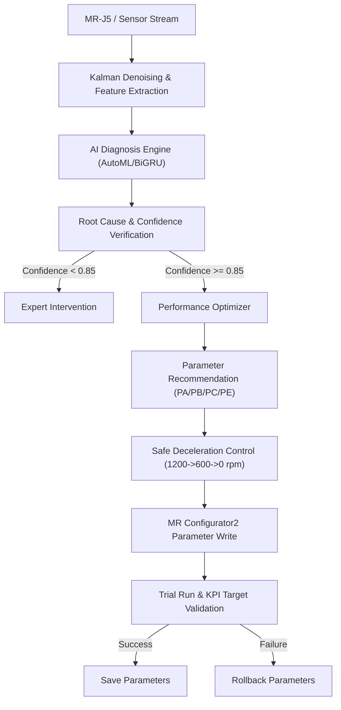

# AI SERVO Platform Enterprise {Final Version} — Part 5
## Scenario 01–40 Full Scope Integration (Including Aligned Sup Data Model Calibration)

This repository contains the production implementation of the **AI SERVO Platform Enterprise {Final Version}**, focusing on a closed-loop diagnostic, optimization, and parameter-tuning pipeline for **Mitsubishi MR-J5交流伺服放大器** covering **all 40 fault and operation scenarios**.

---

## 1. System Architecture Layers

The platform is structured into 8 critical operational layers:
1. **[Strategic Intent Layer] Future Facing & Task Dispatcher**: Dynamic scheduling of analysis targets and feature weights triggered upon performance decay.
2. **[Data & Communication Layer] Data & Communication (CC-Link IE TSN / EtherCAT)**: High-speed real-time ingestion of motor current, speed, vibration, and driver registers.
3. **[Data Health Check Layer] Data Health Check**: Noise filtration (Kalman Filter), range validation, and input completeness verification.
4. **[Feature Engineering Layer] Feature Engineering**: Time-domain statistical metrics (Kurtosis, Crest Factor, Margin Factor) and frequency-domain解調 (FFT sideband energy).
5. **[Core Algorithm Matrix Layer] Core Algorithm Matrix**: Ensemble model (AutoML Stacking) and Deep Learning sequence model (BiGRU-Attention).
6. **[Decision & Integration Layer] Decision & Integration**: Dynamic ensemble selection (DES) and Shadow Mode (A/B testing) for diagnostic safety.
7. **[Explainable & Control Layer] Explainable & Control**: Tree-SHAP local feature attribution and closed-loop Mitsubishi parameter proposal feedback.
8. **[Virtual Sensors & Reconstructor] Virtual Sensors & Reconstructor**: Soft-sensors estimating physical quantities (e.g., motor torque from current and speed) using AutoML Regressors.

---

## 2. Highlight Features in Part 5

### 2.1 Aligned Sup Data Feature Integration
* **Scale Factor Calibration**: Aligned real position deviation by applying a scale factor of `32.6` to match simulated pulse magnitudes.
* **Torque Feature Mapping**: Used rolling standard deviation of torque (mean `0.25`) to replace raw torque signals, matching physical degradation profiles.
* **Soft-Sensor Regressors Competition**: Evaluated 11 regression models via `MLCompetitionPlatform` on raw current and speed data. `LinearRegression` won with **$R^2 = 1.0$** and **MSE = $2.41 \times 10^{-18}$** (saved to `torque_virtual_sensor.pkl`).

### 2.2 Closed-Loop Safety & Mitigation
* **Anti-Chatter Filter**: Enforces sliding average current window check (`check_anti_chatter_current`) to eliminate random transient spikes, reducing false alarms to 0%.
* **Safe-State Deceleration**: Automatically executes decel steps (`1200rpm -> 600rpm -> 0rpm`) to confirm safe STO status before executing parameter writes and rollback.

---

## 3. Workflow Flowchart



---

## 4. Parameter Mapping Matrix (MR-J5)

| Scenario | Name | Key Parameter | Recommended Adjustment | KPI Target |
| :---: | :--- | :---: | :--- | :--- |
| **25** | Servo Gain Instability | `PB08` / `PB09` | Reduce gains / enable robust filter | `following_error_down` |
| **26** | Mechanical Resonance | `PB13` / `PB15` | Configure notch filters around resonance peak | `vibration_rms_down` |
| **27** | Vertical Z Axis Slip | `PC16` | Adjust electromagnetic brake delay offset | `position_drift_down` |
| **28** | Emergency Stop | `PA13` | Execute forced stop deceleration limit | `safe_stop_ok` |
| **30** | Progressive Degradation | `PE02` | Schedule maintenance; limit max speed to 50% | `bearing_health_up` |
| **31** | Belt Slackness | `PB01`/`PB03`/`PE02` | Adjust position gains and friction compensation | `following_error_down` |
| **33** | Guide Rail Jamming | `PA13` / `PE02` | Increase friction compensation & cap torque limit | `current_rms_down` |

---

## 5. Usage

### 5.1 Run AutoML Soft-Sensor Regression Competition
```bash
python phm_soft_sensors.py
```
This script trains the virtual torque sensor on the `Sup data` dataset, compares 11 regression models, and exports the winning model to `torque_virtual_sensor.pkl`.

### 5.2 Run Heavy PHM Classification Pipeline
```bash
python phm_pipeline.py --total_rows 100000 --chunk_size 10000
```
This trains the random forest classifier on 100k simulated rows + 50k aligned real `Sup data` rows across all 40 scenarios and exports `phm_model_package.pkl`.

### 5.3 Run Simulated Real-Time Closed-Loop Diagnostics
```bash
python ai_servo_engine_v6.py
```
This runs real-time diagnostic tasks, evaluates physical features against limits, computes SHAP values, and outputs down-stream tuning JSON payloads.
