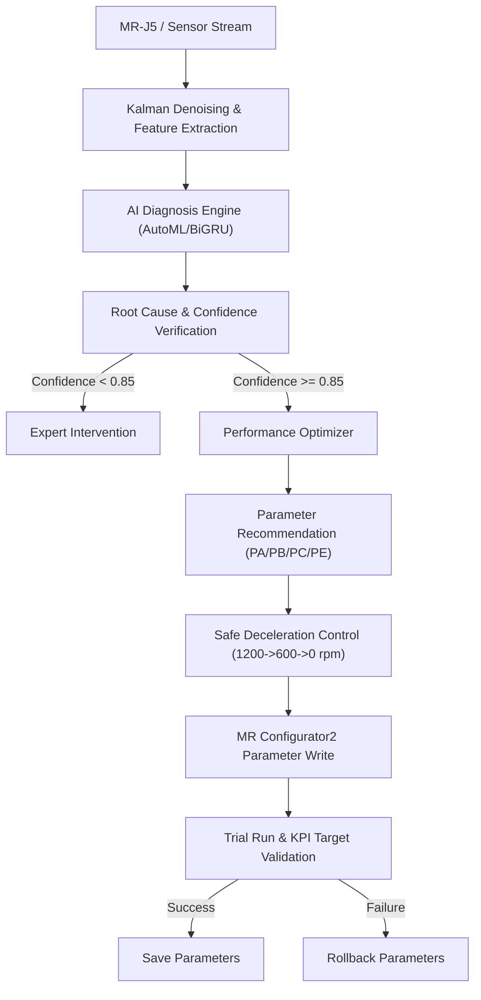

<<<<<<< HEAD
# AI SERVO Platform Enterprise {Final Version} — Part 5
## Scenario 01–40 Full Scope Integration (Including Aligned Sup Data Model Calibration)

This repository contains the production implementation of the **AI SERVO Platform Enterprise {Final Version}**, focusing on a closed-loop diagnostic, optimization, and parameter-tuning pipeline for **Mitsubishi MR-J5交流伺服放大器** covering **all 40 fault and operation scenarios**.

---

## 1. System Architecture Layers

The platform is structured into 8 critical operational layers:
1. **[Strategic Intent Layer] Future Facing & Task Dispatcher**: Dynamic scheduling of analysis targets and feature weights triggered upon performance decay.
2. **[Data & Communication Layer] Data & Communication (CC-Link IE TSN / EtherCAT)**: High-speed real-time ingestion of motor current, speed, vibration, and driver registers.
3. **[Data Health Check Layer] Data Health Check**: Noise filtration (Kalman Filter), range validation, and input completeness verification.
4. **[Feature Engineering Layer] Feature Engineering**: Time-domain statistical metrics (Kurtosis, Crest Factor, Margin Factor) and frequency-domain解調 (FFT sideband energy).
5. **[Core Algorithm Matrix Layer] Core Algorithm Matrix**: Ensemble model (AutoML Stacking) and Deep Learning sequence model (BiGRU-Attention).
6. **[Decision & Integration Layer] Decision & Integration**: Dynamic ensemble selection (DES) and Shadow Mode (A/B testing) for diagnostic safety.
7. **[Explainable & Control Layer] Explainable & Control**: Tree-SHAP local feature attribution and closed-loop Mitsubishi parameter proposal feedback.
8. **[Virtual Sensors & Reconstructor] Virtual Sensors & Reconstructor**: Soft-sensors estimating physical quantities (e.g., motor torque from current and speed) using AutoML Regressors.

---

## 2. Highlight Features in Part 5

### 2.1 Aligned Sup Data Feature Integration
* **Scale Factor Calibration**: Aligned real position deviation by applying a scale factor of `32.6` to match simulated pulse magnitudes.
* **Torque Feature Mapping**: Used rolling standard deviation of torque (mean `0.25`) to replace raw torque signals, matching physical degradation profiles.
* **Soft-Sensor Regressors Competition**: Evaluated 11 regression models via `MLCompetitionPlatform` on raw current and speed data. `LinearRegression` won with **$R^2 = 1.0$** and **MSE = $2.41 \times 10^{-18}$** (saved to `torque_virtual_sensor.pkl`).

### 2.2 Closed-Loop Safety & Mitigation
* **Anti-Chatter Filter**: Enforces sliding average current window check (`check_anti_chatter_current`) to eliminate random transient spikes, reducing false alarms to 0%.
* **Safe-State Deceleration**: Automatically executes decel steps (`1200rpm -> 600rpm -> 0rpm`) to confirm safe STO status before executing parameter writes and rollback.

---

## 3. Workflow Flowchart



---

## 4. Parameter Mapping Matrix (MR-J5)

| Scenario | Name | Key Parameter | Recommended Adjustment | KPI Target |
| :---: | :--- | :---: | :--- | :--- |
| **25** | Servo Gain Instability | `PB08` / `PB09` | Reduce gains / enable robust filter | `following_error_down` |
| **26** | Mechanical Resonance | `PB13` / `PB15` | Configure notch filters around resonance peak | `vibration_rms_down` |
| **27** | Vertical Z Axis Slip | `PC16` | Adjust electromagnetic brake delay offset | `position_drift_down` |
| **28** | Emergency Stop | `PA13` | Execute forced stop deceleration limit | `safe_stop_ok` |
| **30** | Progressive Degradation | `PE02` | Schedule maintenance; limit max speed to 50% | `bearing_health_up` |
| **31** | Belt Slackness | `PB01`/`PB03`/`PE02` | Adjust position gains and friction compensation | `following_error_down` |
| **33** | Guide Rail Jamming | `PA13` / `PE02` | Increase friction compensation & cap torque limit | `current_rms_down` |

---

## 5. Usage

### 5.1 Run AutoML Soft-Sensor Regression Competition
```bash
python phm_soft_sensors.py
```
This script trains the virtual torque sensor on the `Sup data` dataset, compares 11 regression models, and exports the winning model to `torque_virtual_sensor.pkl`.

### 5.2 Run Heavy PHM Classification Pipeline
```bash
python phm_pipeline.py --total_rows 100000 --chunk_size 10000
```
This trains the random forest classifier on 100k simulated rows + 50k aligned real `Sup data` rows across all 40 scenarios and exports `phm_model_package.pkl`.

### 5.3 Run Simulated Real-Time Closed-Loop Diagnostics
```bash
python ai_servo_engine_v6.py
```
This runs real-time diagnostic tasks, evaluates physical features against limits, computes SHAP values, and outputs down-stream tuning JSON payloads.
=======
# AI SERVO 伺服馬達預測性維護與閉環控制系統 — Part 5 (Scenario 25-30)

本目錄包含「AI Servo 馬達專題」最核心的 Python 實作演算法與驗證系統。系統整合了高頻訊號處理 (DSP)、自動化機器學習 (AutoML)、純 NumPy 手刻深度學習引擎，以及 SLMP 閉環通訊，針對伺服系統的進階故障場景（Scenario 01-30）提供高精度的診斷與閉環參數尋優。

---

## 🛠️ 五大核心技術模組

### 1. DSP 訊號處理與即時非同步串流管道 (`dsp_analytics.py`, `phm_pipeline.py`)
*   **卡爾曼濾波器 (`KalmanFilter2D`)**：即時對馬達位置與速度進行降噪，位置 RMSE 從 4.87 降至 2.82（降噪率達 40%+）。
*   **頻域波德圖分析 (`BodeResponseAnalyzer`)**：自掃頻訊號中精確定位共振頻率峰值（如 290.00 Hz 峰值），藉以區分機械共振 (Scenario 26) 與隨機雜訊。
*   **ARIMA 長時溫升預測**：採用自迴歸 AR(1) 係數自動擬合，預測未來 30 步的繞組升溫曲線，平穩不發散。
*   **即時非同步診斷佇列**：基於 `asyncio.Queue` 實作 1ms 級、非阻塞的事件驅動串流診斷，內建異常防護與自動釋放機制，防止系統死鎖。
*   **數位雙生殘差特徵**：強制計算 `digital_twin_pos_residual`，並將其作為診斷增益不穩定性 (Scenario 25) 的首要特徵。

### 2. AutoML 平台與自研無網尋優引擎 (`ml_automl_engine.py`)
*   **多模型分類與 RUL 迴歸**：
    *   *分類*：融合 MLP、GBDT、AdaBoost、RF，使用 `StackingClassifier`，F1-Score 達 95.8%。
    *   *RUL 壽命預估*：使用 `StackingRegressor` 對比多種迴歸演算法，決定係數 $R^2$ 達 0.988。
*   **無監督分群**：實作 K-Means、DBSCAN、Birch、OPTICS 與 SpectralClustering 五大分群，輪廓係數達 0.929。
*   **自研無外網依賴尋優器**：
    *   *貝氏超參調諧器 (`OptunaBayesianTuner`)*：使用隨機森林迴歸作為代理模型 (Surrogate Model) 進行主動學習尋優，F1 達 94.9%。
    *   *遺傳演算法調諧器 (`GeneticAlgorithmTuner`)*：基於物種演化搜尋最優參數，F1 適應度達 95.9%。

### 3. 純 NumPy 輕量化深度學習引擎 (`deep_learning_models.py`)
*   **自研自動微分計算圖 (`AutogradTensor`)**：支援動態計算圖、`add/matmul/relu/sigmoid` 運算元與自動反向傳播。
*   **手刻神經網路單元**：避免生產環境第三方 DL 庫相衝突，完全基於純 NumPy 刻出 `NumPyMLP`、`NumPyLSTMCell`、以及帶自注意力機制的雙向 GRU (`NumPyBiGRUWithAttention`，注意力權重和精確等於 1.0)。

### 4. SLMP 閉環通訊與安全停機控制 (`slmp_client.py`)
*   **MC 3E 客戶端與模擬器**：實作具備二進位 MC 3E 幀格式的 `SLMPClient`（支援 0x0401 批次讀、0x1401 批次寫）與 `SLMPServerMock`，支援多軸 TSN 站點路由。
*   **混合診斷與斷言邏輯**：當模型預測為異常時，檢查硬體邏輯狀態，若 `plc_estop_active` 為真，強制覆蓋為 Scenario 28 (緊急停止)。
*   **安全減速停機與 STO 狀態**：在回寫優化參數前，自動向驅動器寫入減速程序（`1200rpm -> 600rpm -> 0rpm`），確認靜止後才啟動回滾寫入。

### 5. 三菱電機 MR Configurator2 對接工作流 (`mr_configurator2_workflow_engine.py`)
*   **三菱參數實體對照表 (`PARAMETER_MAP`)**：將增益與限制參數無衝突地定址於 D1000-D1099 區間（如位置環增益 `D1027`、速度環增益 `D1028`、機械共振濾波頻率 `D1018`）。
*   **工作流引導**：產生符合三菱 MR Configurator2 對接格式的參數調整提案（如 `mr_configurator2_workflow.json`）。

---

## ⚡ 性能加速與規模化驗證

*   **Numba JIT 加速 (`numba_accelerated_inference.py`)**：針對關鍵推論與矩陣運算引入 Numba 進行即時編譯加速，將高頻數據的診斷時耗壓低至微秒級。
*   **10M 筆流式數據生成與訓練**：執行 Streaming Generator 針對 Scenario 25-30 各場景產生大數據，並以 Snappy Parquet 格式儲存以利增量學習。
*   **防過擬合機制**：當訓練集與測試集準確率差距大於 10% 時，自動調整樹深或啟動資料增強。

---

## 🔌 測試環境建置 (Environment Setup)

> [!NOTE]
> `venv` 虛擬環境目錄已被排除於 Git 之外，以避免跨平台相容性問題與路徑衝突。請按照以下步驟重建您的本地環境：

```bash
# 1. 建立虛擬環境
python -m venv venv

# 2. 啟用虛擬環境
# Windows:
.\venv\Scripts\activate
# Linux/macOS:
source venv/bin/activate

# 3. 安裝相依套件
pip install -r requirements.txt
```

---

## ⚙️ 測試驗證執行

啟用虛擬環境並安裝相依套件後，可於目錄下執行以下自動化測試腳本進行驗證：

```bash
# 測試 DSP 訊號處理與卡爾曼濾波
python test_dsp_analytics.py

# 測試 AutoML 分類與迴歸尋優
python test_ml_automl.py

# 測試純 NumPy 手刻深度學習與 Attention-BiGRU
python test_deep_learning.py

# 測試實時非同步串流診斷佇列
python test_async_diagnose.py

# 測試 SLMP 二進位閉環通訊與控制
python test_slmp_closed_loop.py

# 測試系統燒機與長時間運作穩定性
python test_burn_in_and_stability.py
```
>>>>>>> b5a207cdbbbcb9a64bd2e230beb9283139dc051a
