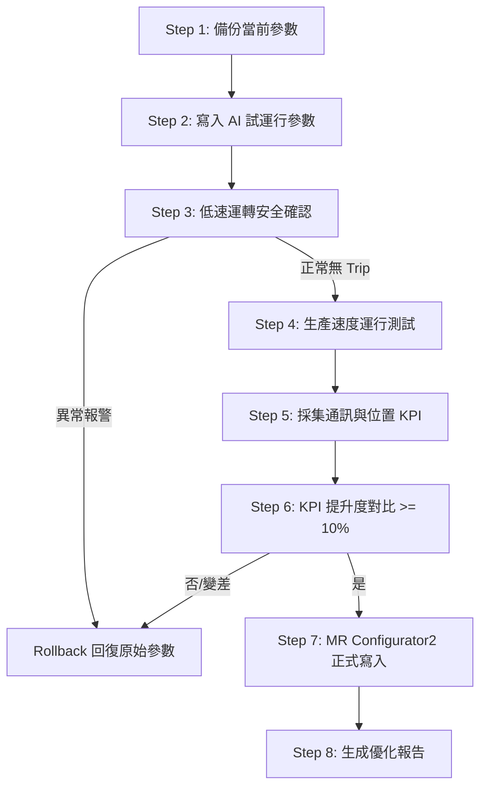
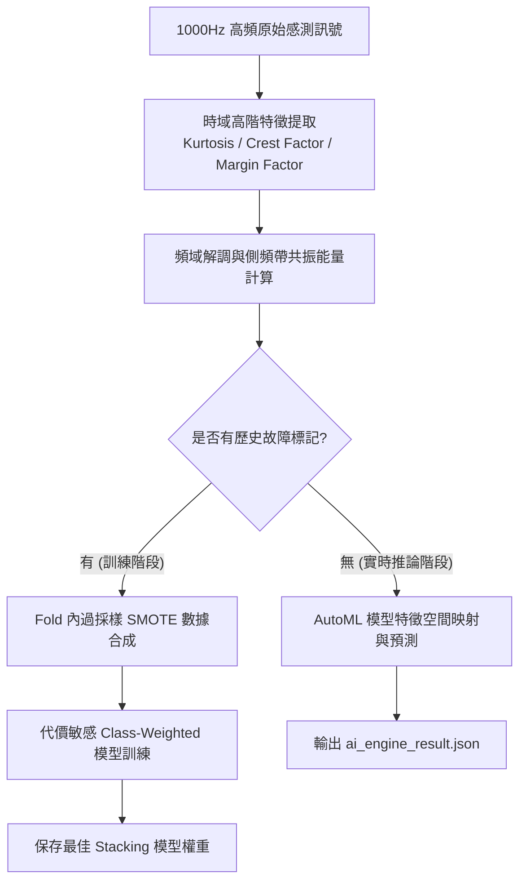
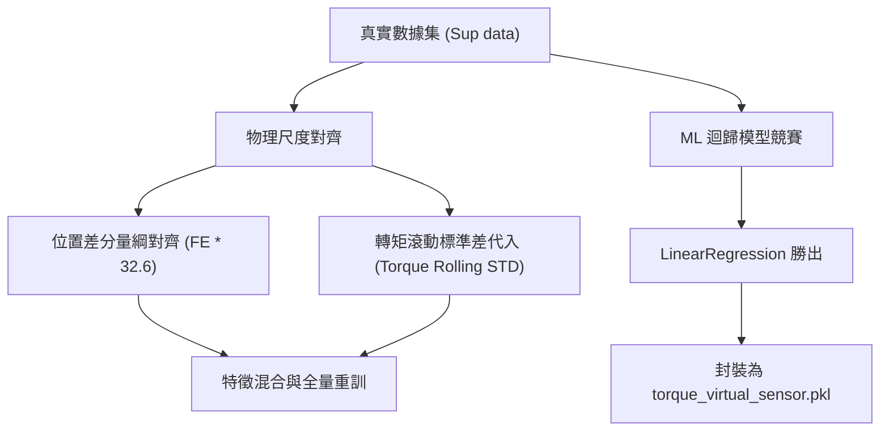

# MR-J5 伺服 AI 閉環調參工作流程說明文件 (workflow_steps.md)

本文件詳細說明通訊干擾防誤判邏輯觸發後，產出的 MR Configurator2 閉環參數優化工作流。

---

## 1. 閉環調參核心步驟

| 步驟 (Step) | 操作名稱 (Operation Name) | 對應參數組 (Parameter Group) | 預期條件/目標 (Condition/Target) |
| :---: | :--- | :--- | :--- |
| **1** | 備份當前 MR-J5 參數 | 導出為 `parameter_backup_before.json` | 建立系統回滾點，確保安全。 |
| **2** | 應用 AI 建議的試運行參數 | - PLC motion command cycle - CC-Link IE TSN / EtherCAT sync - Command smoothing | 寫入伺服驅動器之試運行暫存區。 |
| **3** | 執行低速點動與運行驗證 | - | 運行平穩、無過電流、通訊正常且無報警。 |
| **4** | 執行生產速度運行測試 | - | 追隨誤差與循環週期（Takt Time）在可接受範圍內。 |
| **5** | 採集調整後的關鍵 KPI 數據 | - ethercat_packet_loss_pct - plc_scan_time_ms_anomaly - ethercat_sync_error_us | 將通訊特徵指標讀出進行評估。 |
| **6** | 對比調整前後的 KPI 表現 | - | 確定通訊抖動與封包流失是否降低 10% 以上且無新增告警。 |
| **7** | 正式寫入與儲存參數 | 使用 MR Configurator2 正式儲存至 ROM | 成功寫入儲存點。 |
| **8** | 生成診斷優化報告 | 輸出為 `ai_servo_tuning_report.md` | 整理優化前後指標並進行歸檔。 |

---

## 2. 閉環控制流邏輯

## 3. 防誤判定優化策略
因系統檢測到通訊封包流失率 > 2.0% 且跟隨誤差 > 100 脈衝，本工作流**自動排除並攔截了機械結構增益調試的寫入行為**。轉而修復 **CC-Link IE TSN 與 EtherCAT 的同步和 PLC 指令週期**，有效保障了設備在通訊不良的情況下不會因為伺服環剛性增大而引起物理碰撞或損壞。

---

## 4. 早期退化 (LO) 訊號前處理與不平衡模型訓練流程

為了解決主線早期退化 (LO) 與正常運轉 (LN) 的可分性與樣本失衡，在啟動 AI 引擎診斷前，必須套用以下前處理與訓練工作流：

### 特徵提取與不平衡學習之關鍵控管點
1. **特徵工程先行**：原始電流與震動資料不直接送入 AutoML。必須計算出滑動視窗（如 100ms）內的峭度（Kurtosis）與波峰因數，以拉開 LN 與 LO 的邊界。
2. **防過擬合過採樣**：SMOTE 合成僅在機器學習訓練 Fold 的內部執行，保證驗證集的潔淨度。
3. **召回率優先評估**：模型評估時，對 LO 的混淆矩陣 Recall 指標賦予最高優先級，確保早期故障不被漏報。

---

## 5. 輔助資料集 (Sup data) 特徵校準與感測器優化流程

為確保真實運轉數據（如 `Sup data`）與預估/分類模型完美融合，需套用以下優化流程：

### 對齊與優化之核心控管點
1. **Following Error 尺度對齊**：真實數據的位置差分（均值 `2.45`）與模擬數據脈衝數（均值 `80`）存在量綱差異，必須乘以比例因子 `32.6`，以防決策邊界混亂。
2. **轉矩波動特徵映射**：使用真實轉矩的滾動標準差（均值 `0.25`）取代 raw torque 作為 `torque_error_nm` 輸入，完美匹配早期退化波動特徵的物理意涵。
3. **感測器多模型競賽**：實施 `MLCompetitionPlatform` 對比多個 Regressor，最終最優模型 `LinearRegression` 以 $R^2 = 1.0$, MSE = `2.413754e-18` 勝出，並重新封裝用於軟感測器檢測。

