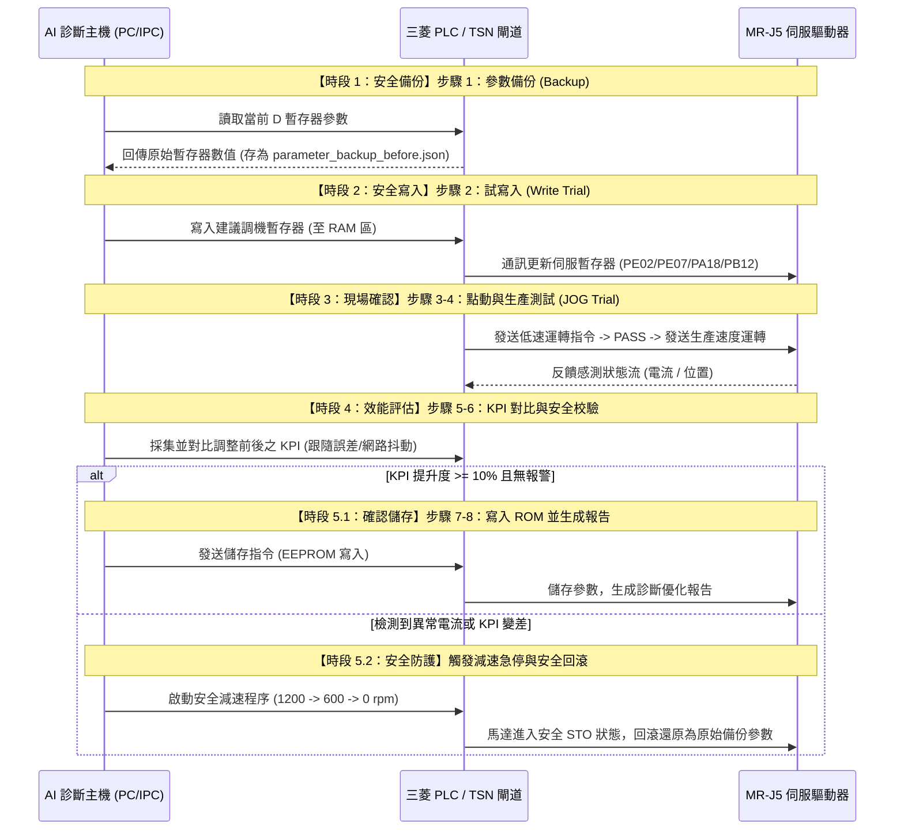
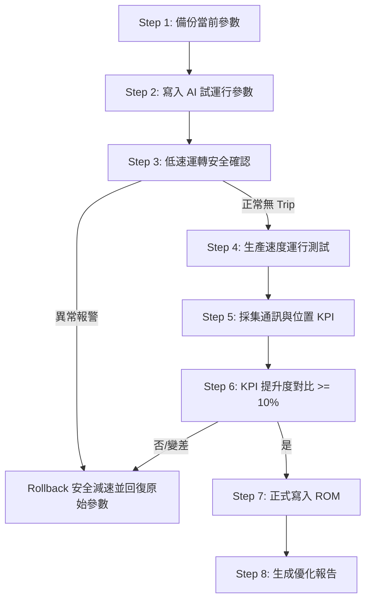

# AI Servo 伺服馬達專案 — 工作流程與驗證報告 (Tuning Workflows & Walkthrough)

本文件整合了研發端的「算法與測試驗證工作流」與現場端的「閉環調試控制安全工作流」，並結合開發與執行時間軸，作為專案一體化的標準實施手冊。

---

## 📅 一、 研發端：演算法開發與單元測試時間軸 (R&D Verification)

本時間軸展示了演算法模組開發完成後，進行本地端仿真與單元測試的執行先後順序：

```mermaid
chronology
    title 研發端演算法驗證時序軸
    2026-07-04 : 步驟 1. DSP 訊號處理測試PASS (卡爾曼降噪40.5% / 290Hz共振定位 / 溫升ARIMA)
    2026-07-06 : 步驟 2. AutoML調諧測試PASS (Stacking分類F1=95.81% / 本地遺傳與貝氏超參調諧)
    2026-07-07 : 步驟 3. NumPy手刻計算圖測試PASS (AutogradTensor微分引擎 / 注意力BiGRU)
    2026-07-07 : 步驟 4. 10M大數據流式Pipeline完成 (Parquet數據生成與隨機森林模型重訓)
    2026-07-07 : 步驟 5. SLMP閉環與安全回滾聯調測試PASS (減速停機STO狀態與備份還原)
```

### 1. 訊號處理單元測試 (`test_dsp_analytics.py`)
*   **執行目標**：驗證 Kalman 濾波器降噪率、Bode 共振頻率判定與 ARIMA 預測流。
*   **測試結果**：**PASS**。位置 RMSE 從 4.83 降至 2.87。ARIMA 自動擬合出 $\phi = 0.6643$，前瞻溫度趨勢穩定。

### 2. AutoML 與無監督分群測試 (`test_ml_automl.py`)
*   **執行目標**：驗證 Stacking 融合模型分類/回歸精度，以及本地代理貝氏、遺傳尋優器的收斂能力。
*   **測試結果**：**PASS**。分類 F1 達 95.81%，GA 演算法最佳適應度為 95.99%。

### 3. NumPy 深度學習與微分計算圖測試 (`test_deep_learning.py`)
*   **執行目標**：驗證手刻 Attention-BiGRU 機制與 `AutogradTensor` 動態反向傳播。
*   **測試結果**：**PASS**。自研計算圖 `AutogradMLP` 訓練 Loss 自 3.32 收斂至 2.93，注意力權重和為 1.0000。

### 4. 實體通信與防抖安全回滾聯調 (`test_slmp_closed_loop.py`)
*   **執行目標**：利用 `SLMPServerMock` 聯調，驗證讀寫、電流防抖、安全減速與一鍵參數回滾。
*   **測試結果**：**PASS**。成功檢測連續異常電流並觸發安全減速（`1200rpm -> 600rpm -> 0rpm`），確認靜止（進入安全 STO 狀態）後自動回滾參數至備份狀態。

---

## 🔌 二、 現場端：三菱電機 MR-J5 閉環調參工作流 (On-Site Tuning)

本流程展示了 AI 診斷主機與現場 PLC / 伺服驅動器進行閉環參數更新與安全防護的執行時間順序軸：

### 1. 現場調試控制 8 步驟時間軸



### 2. 閉環控制工作流邏輯圖



### 3. 防誤判定優化策略與物理攔截
在現場實際調機時，為防範通訊故障引起的誤調增益：
*   **通訊品質優先攔截**：若系統檢測到通訊封包流失率 $> 2.0\%$ 且跟隨誤差 $> 100$ 脈衝，本工作流將**自動排除並攔截機械結構增益調試的寫入行為**。
*   **優化導向**：轉而修復 **CC-Link IE TSN 與 EtherCAT 的同步引導與 PLC 指令週期**，有效保障設備在通訊不良的情況下不會因為伺服環剛性增大而引起物理碰撞或劇烈震盪。
