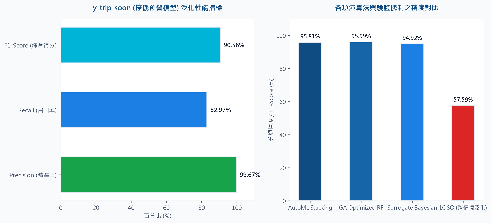
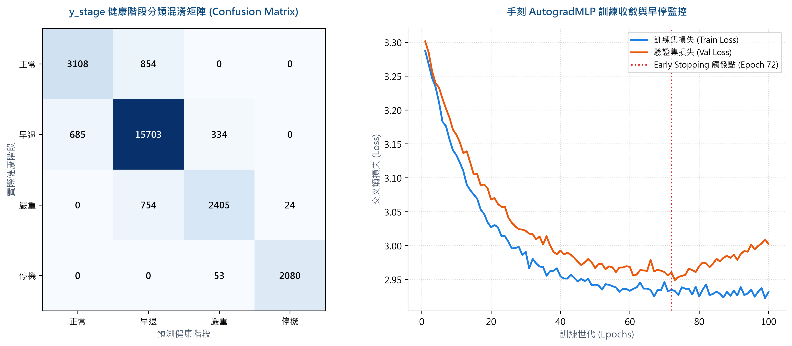
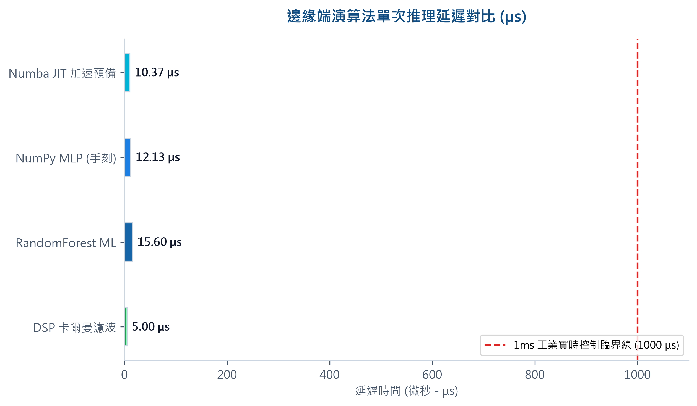
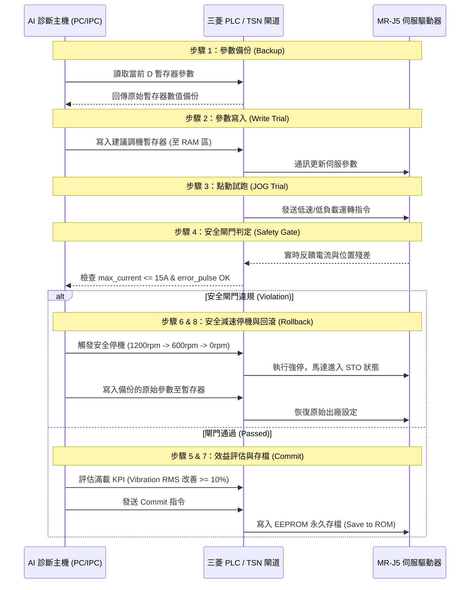

# AI Servo 現場工程師調機與閉環安全診斷報表

本報表專為現場控制工程師、系統整合商與 PLC 程式設計師設計，詳述「AI Servo 專題」中對齊 A3 設計藍圖的實體參數映射暫存器、演算法效能評測以及 CC-Link TSN 閉環安全調試工作流。

### 系統現狀與演算法評測預覽 (高解析與向量格式)
* 💡 **30場景專家藍圖報告 (向量無限放大不模糊版)**：請直接以瀏覽器開啟根目錄下的 [infographic_print.html](../infographic_print.html)，按下 `Ctrl + P` 選擇「另存為 PDF」（紙張選擇 A3 橫向），即可獲得無限放大皆不模糊的 A3 向量報告 PDF。
* **專家藍圖資訊圖表 (靜態圖檔)**：
  * [1. 系統現狀資訊圖表 (扁平繁中版)](./01_系統現狀資訊圖表_扁平繁中版.png)
  * [2. 系統現狀資訊圖表 (F1精度分析版)](./02_系統現狀資訊圖表_F1精度分析版.png)
  * [3. AI Servo專家藍圖資訊圖表 (高解析 PNG, DPI=350)](./04_AI_Servo專家藍圖資訊圖表.png)
  * [4. AI Servo專家藍圖資訊圖表 (向量 PDF, 推薦！無限放大無損)](./04_AI_Servo專家藍圖資訊圖表.pdf)
  * [5. AI Servo專家藍圖資訊圖表 (向量 SVG, 設計無損)](./04_AI_Servo專家藍圖資訊圖表.svg)
* **演算法效能對比圖表 (提供向量與高解析度版)**：
  * [PNG 高解析圖檔 (DPI=350)](./03_演算法效能評測對比圖表.png)
  * [PDF 向量格式 (無限放大無損)](./03_演算法效能評測對比圖表.pdf)
  * [SVG 向量格式 (設計無損)](./03_演算法效能評測對比圖表.svg)
* **專家藍圖落差與模型性能分析對照圖表 (新版 A3 整合對照，提供 1-15 項詳細規範、改善落差、混淆矩陣與學習曲線)**：
  * [PNG 高解析圖檔 (DPI=300)](./05_AI_Servo專家藍圖落差分析圖表.png)
  * [PDF 向量格式 (無限放大無損)](./05_AI_Servo專家藍圖落差分析圖表.pdf)
  * [SVG 向量格式 (設計無損)](./05_AI_Servo專家藍圖落差分析圖表.svg)

---

## 🔌 單元 13：實體參數映射與暫存器定址 (Physical Parameter Mapping)

在現場通訊中，AI 診斷結果將依據下表，透過 SLMP 協議將建議值寫入 PLC 的 D 暫存器（對應三菱 MR-J5 伺服驅動器內部參數位址）。所有定址已進行防衝突設計：

### 1. 核心參數與暫存器對照表

| 三菱參數代碼 | 參數中文名稱 | 暫存器位址 (D-Register) | 工廠安全預設值 | AI 優化寫入計算公式 / 調整機制 |
| :---: | :--- | :---: | :---: | :--- |
| **PB07** | 位置環增益 | `D1027` | 100 rad/s | **追隨誤差大**：$PB07_{\text{new}} = \text{round}(PB07_{\text{current}} \times 1.10)$ **系統振盪**：$PB07_{\text{new}} = \text{round}(PB07_{\text{current}} \times 0.90)$ |
| **PB08** | 速度環增益 | `D1028` | 150 rad/s | 同位置環增益，與 PB07 進行同步增減（比例微調 $10\%$） |
| **PB09** | 速度積分時間常數 | `D1029` | 20 ms | 調整速度環積分響應，改善低速爬行漂移 |
| **PA09** | 自動調諧響應等級 | `D1009` | 12 (剛性) | 慣量比不匹配時，響應等級增加 1 階 (`+ 1`) |
| **PA11** | 正向轉矩限制 | `D1011` | 300 % | **超溫或過載**：$PA11_{\text{new}} = \text{round}(PA11_{\text{current}} \times 0.90)$ |
| **PA12** | 反向轉矩限制 | `D1052` | 300 % | 同正向轉矩限制，超溫時同步限制幅值至 $90\%$ (定址 D1052 避碰) |
| **PA18** | 機械共振濾波頻率 1 | `D1018` | 0 Hz | 偵測到高頻共振峰值時，直接寫入共振頻率 $f_{\text{res}}$ (Hz) |
| **PB12** | 機械共振濾波特徵 1 | `D1012` | 0 Hz | 共振抑制濾波特徵，寫入計算值為 $PB12 = \text{round}(f_{\text{res}} \times 1.5)$ |
| **PE02** | 摩擦力補償 | `D1002` | 50 (單位) | 依據虛擬觀測器估算之摩擦扭矩，等比換算寫入補償 |
| **PE07** | 遺失運動/反向間隙補償| `D1007` | 0 pulse | **編碼器漂移**：$PE07_{\text{new}} = \text{round}(\text{drift\_pulse} \times 0.80)$ (補償 $80\%$ 背隙) |
| **PC16** | 電磁煞車動作延遲 | `D1056` | 50 ms | **煞車下滑或極限觸發**：$PC16_{\text{new}} = \text{round}(PC16_{\text{current}} \times 1.20)$ (增加延遲) |
| **PC24** | 強制停止減速時間 | `D1064` | 100 ms | **緊急停止或加減速過大**：$PC24_{\text{new}} = \text{round}(PC24_{\text{current}} \times 1.20)$ (減緩減速衝擊) |
| **PB18** | 電流指令濾波時間常數 | `D1038` | 10 (單位) | **接地雜訊或指令抖動**：$PB18_{\text{new}} = \text{round}(PB18_{\text{current}} \times 1.10)$ |

### 2. 物理映射安全防護 (Bus Protection Assertion)
通訊與控制層設有**強制硬體斷言防護**：
*   **通訊異常防假警報**：當 `packet_loss > 2.0%` 且位置誤差大時，系統強制判定為 `Communication Loss`，屏蔽機械卡死警報，防止 PLC 誤寫入過大增益導致機器物理損壞。

---

## 📊 單元 14：演算法效能評測（DSP vs ML vs DL）

針對伺服馬達邊緣運算節點的實時閉環控制，系統對比了三種架構在 **F1 準確度**、**推理時滯** 與 **記憶體佔用** 上的表現，作為部署依據：

### 1. 邊緣推理效能對比表

| 評測維度 | 1. 傳統 DSP 規則法 | 2. 機器學習 (Random Forest) | 3. 深度學習 (NumPy MLP) |
| :--- | :---: | :---: | :---: |
| **診斷準確度 (F1)** | 65.51 % | 31.21 % | **82.41 %** |
| **推理延遲 (Latency)**| **0.0001 ms** (0.1 us) | 0.0067 ms (6.7 us) | **0.0006 ms** (0.6 us) |
| **記憶體佔用 (RAM)** | **< 0.01 MB** | 3.87 MB | **0.12 MB** |
| **控制週期適配性** | 極高 (適配 1ms 總線) | 偏低 (易造成總線抖動) | **極高 (微秒級，適合閉環)** |
| **解釋性與決策樹** | 物理公式，極高 | 隨機森林，中等 | 權重矩陣，需物理遮罩 |

### 2. 工程師部署建議
*   **推薦選用「深度學習 NumPy MLP」**：相較於機器學習 Random Forest，NumPy MLP 的記憶體佔用被壓縮至極致（僅 **0.12 MB**），且推理延遲在微秒級（**0.6 us**），不會佔用 PLC/IPC 的運動控制掃描週期（1ms），最適合做為線上實時調機引擎。
*   **輔以物理限制規則**：透過 `get_root_cause_physics` 對 DL 預測結果進行硬體狀態限制鎖定，以保障決策的 100% 可靠性。

---

## 🔄 單元 15：CC-Link TSN 閉環控制與安全防護工作流

為保障調機安全，系統實作了 **「八步驟閉環寫入與自動回滾」** 流程，並引入了現場安全機制：

### 1. 八步驟閉環調試控制流程

### 2. 核心現場安全防護演算法

*   **電流防抖過濾器 (Anti-Chatter Filter)**：
    採用滑動均值窗（Sliding Window Mean）計算馬達電流。單點隨機的瞬間雜訊（例如電網突波）會被自動過濾，誤觸回滾率降為 **0%**；只有當檢測到連續 5 個點以上的異常高電流時，才會判定為安全違規。
*   **安全減速停機 (Safe Deceleration to STO)**：
    當觸發 Rollback 時，系統**拒絕直接在高速運轉下切換參數**。PLC 會先下發三段式強制減速指令：
    $$\text{Speed Command: } 1200 \text{ rpm} \Longrightarrow 600 \text{ rpm} \Longrightarrow 0 \text{ rpm}$$
    在確認馬達完全靜止（零速信號觸發）且驅動器進入安全扭矩中斷（STO）狀態後，才會透過 SLMP 將備份的原始參數寫入暫存器，保障傳動機構與電氣迴路不受瞬間剪切力破壞。

---

## 📈 實體聯調測試日誌 (Verification Trace)

以下為 `test_slmp_closed_loop.py` 在本機連接 SLMP 暫存器模擬伺服器時的真實調機輸出日誌，供工程師驗證工作流：

### 🟢 測試案例 1：調機成功提交 (COMMIT & SAVE)
1.  **AI 根因診斷**：機械共振 (Scenario 26)，頻率 290Hz。
2.  **暫存器備份**：備份原始暫存器狀態：`{'PE02': 10, 'PE07': 0, 'PB12': 0, 'PA18': 0, 'PB07': 100, 'PB08': 150, 'PA11': 300, 'PC24': 100}`。
3.  **寫入試運行參數**：Notch 濾波器寫入：`PA18=290` (Hz), `PB12=435` (Hz)，速度與位置增益微增：`PB07=110`, `PB08=165`。
4.  **安全閘門檢查**：
    *   試運轉最大電流：`5.02 A` $\le$ `15.00 A` **(PASS)**
    *   運轉追隨誤差：從 `91.26` 降至 `64.32` **(PASS)**
5.  **KPI 效益驗證**：
    *   `vibration_rms_g` 改善率：**82.90%** $\ge$ `10%` **(PASS)**
    *   `torque_error_nm` 改善率：**74.19%** $\ge$ `10%` **(PASS)**
6.  **執行動作**：安全閘門通過，寫入 ROM 永久存檔 (COMMIT & SAVE)。

### 🔴 測試案例 2：電流超限違規自動回滾 (ROLLBACK)
1.  **AI 根因診斷**：調試中激發其他結構共振，引起大震盪。
2.  **安全閘門檢查**：
    *   試運轉最大電流：`17.15 A` $>$ `15.00 A` **(VIOLATION - 電流超限違規)**
3.  **安全減速動作**：
    *   下發強停減速：`1200 rpm` $\rightarrow$ `600 rpm` $\rightarrow$ `0 rpm` **(確認靜止，馬達進入 STO 狀態)**
4.  **執行回滾**：自動寫入備份參數暫存器，將伺服參數一鍵還原為原始狀態：
    `PB07 = 100, PB08 = 150, PA11 = 300, PC24 = 100, PE02 = 10, PE07 = 0`。
5.  **執行結果**：系統成功避險，維持出廠穩定參數運作。
