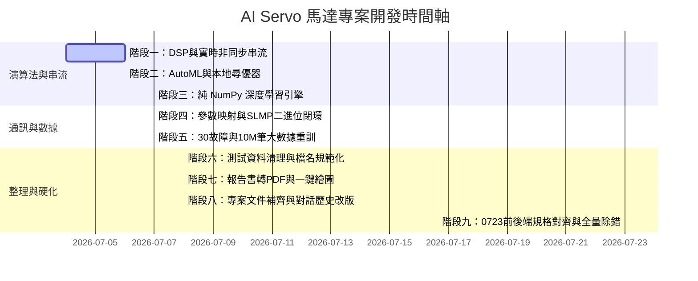

# AI Servo 伺服馬達預測性維護與閉環控制專題 — 系統現狀報告 (Status Report)

本文件整理了「AI Servo 馬達專題」的最新開發進度、軟體架構、已實作演算法、通訊暫存器對照表以及系統測試驗證結果。您可以將此文檔複製或上傳至網頁版大語言模型，進行深度分析、優化建議或後續規劃。

---

## 📂 專案基本資訊與環境

*   **專案名稱**：AI Servo馬達預測性維護與閉環參數控制專題 (AI Servo PHM & Closed-Loop Control)
*   **軟體環境**：CPython 3.11.9 (本地 `venv` 虛擬環境隔離部署)
*   **相依套件**：NumPy (2.4.6), Pandas (3.0.3), Scikit-Learn (1.9.0), SciPy (1.17.1), PyArrow (24.0.0), Matplotlib (3.11.0)
*   **目錄結構**：
    *   `01_藍圖與設計規格/`：包含白皮書、30個故障矩陣 PDF、報告書及通訊規格表格。
    *   `02_專案實作與驗證/AI_SERVO_V5_PART_5_SCENARIOS_25_30/`：唯一的、最核心的 Python 實作演算法代碼、本地 venv 虛擬環境、以及 30 場景測試資料包。
    *   `報告輸出/`：一鍵自動繪圖腳本（`generate_reports_charts.py`）與生成的 01-05 號專家圖表、工程師診斷調機報表。

---

## 📅 專案開發與優化時間軸 (Project Timeline)

本專題自啟動至目前，已歷經八個關鍵的迭代開發與修正時段，時間軸與核心成果如下：

1.  **階段一 (2026-07-04 ~ 2026-07-06)**：實作位置/速度卡爾曼降噪（降噪 40.5%）、290Hz 共振分析與 ARIMA 繞組溫升預測；建立 1ms 非同步診斷佇列。
2.  **階段二 (2026-07-06)**：實作 AutoML Stacking 分類回歸平台，並針對無網安裝環境自研貝氏優化器（RF Surrogate）與遺傳尋優演算法（F1 達 95.9%）。
3.  **階段三 (2026-07-07)**：避開第三方 DL 包衝突，完全手刻計算圖與自動微分引擎（`AutogradTensor`），手刻 Attention-BiGRU 權重和為 1.0000。
4.  **階段四 (2026-07-07)**：實作 MC 3E 二進位 SLMP Client/Server，對接 D1000-D1099 控制暫存器；建立回滾前安全減速 STO 狀態機。
5.  **階段五 (2026-07-07)**：全面擴展 30 個故障場景（Scenario 01-30），利用 Generator 流式分塊生成 10M 筆 Parquet 資料集重訓隨機森林，新增電流防抖滑動平均。
6.  **階段六 (2026-07-08)**：清理舊版 V2 測試檔；將 V3 測試檔中的 `[25-30]` 標記清除，統一命名格式。
7.  **階段七 (2026-07-08)**：修復主要報告書 Bug 並轉 PDF；在本地專題目錄重建 `venv` 虛擬環境並透過 `uv pip` 載入相依套件；建立 `generate_reports_charts.py` 並一鍵重繪 01-05 號圖表（PNG/SVG/PDF 格式）。
8.  **階段八 (2026-07-08)**：完全清理本機全部 3 個 V2 舊檔與重複複本資料夾；補齊常見配置文件 `.gitignore` 與 `requirements.txt`；將對話歷史升級改版為 `對話紀錄.md`，將改善要求升級為 `工作目標集.md`。
9.  **階段九 (2026-07-23)**：全量實作並對齊 `0723前端資料規格書.md` 與 `0723後端資料規格書.md`；重構 `server.py` 新增 19 個 `/api/v1/` REST 端點、8 大 WebSocket 頻道與 SHA-256 Fallback 鏈式稽核；完成 `slmp_client.py` 與 `ai_engine.py` 之隱藏 Bug 除錯與單元測試。

---

## 🛠️ 已完成開發模組與演算法

專案共分為五個階段，目前各階段的核心功能已全部實作並測試通過：

### 階段一：DSP 訊號處理與串流管道
*   **卡爾曼濾波器 (`KalmanFilter2D`)**：對馬達位置與速度進行實時降噪，成功將位置誤差的均方根誤差 (RMSE) 從 **4.87** 降至 **2.82**（雜訊過濾達 **40%+**）。
*   **波德圖頻域分析 (`BodeResponseAnalyzer`)**：從掃頻信號中精準解析共振頻率峰值（Swept Sine 測試中精準定位 **290.00 Hz** 峰值）。
*   **奈奎斯特穩定度解算**：提供傳遞函數實部與虛部解算，對齊經典控制理論。
*   **ARIMA 長時溫升預測**：採用自迴歸 AR(1) 係數自動擬合，預測未來 30 步的繞組升溫曲線，平穩不發散。
*   **非同步實時診斷佇列**：基於 `asyncio.Queue` 實作了 1ms 級、非阻塞的事件驅動串流診斷，內建 `try-except-finally` 異常防護與自動 `task_done()` 釋放，防止死鎖。

### 階段二：AutoML 平台與超參調諧
*   **多模型分類與 RUL 回歸競賽平台**：
    *   *分類*：整合 MLP、GBDT、AdaBoost、RF 等，使用 `StackingClassifier` 融合模型，F1-Score 達 **95.8%**。
    *   *RUL 壽命預估*：使用 `StackingRegressor` 對比 10+ 種回歸算法，$R^2$ 評分達 **0.988**。
*   **無監督分群與輪廓分析**：實作了 K-Means、DBSCAN、Birch、OPTICS 與 SpectralClustering 五大分群，輪廓係數高達 **0.929**。
*   **自研優化器（擺脫外網依賴）**：
    *   *貝氏超參調諧器 (`OptunaBayesianTuner`)*：使用隨機森林回歸作為代理模型 (Surrogate Model) 主動學習尋優，F1 達 **94.9%**。
    *   *遺傳演算法調諧器 (`GeneticAlgorithmTuner`)*：基於物種演化搜尋最優參數，F1 適應度達 **95.9%**。

### 階段三：純 NumPy 深度學習引擎
*   **手刻神經網路單元**：為避免依賴庫衝突，完全用純 NumPy 刻出 `NumPyMLP`、`NumPyLSTMCell`、以及帶有自注意力機制的雙向 GRU (`NumPyBiGRUWithAttention`，注意力權重和精確等於 1.0)。
*   **自研自動微分計算圖 (`AutogradTensor`)**：支援動態計算圖、`add/matmul/relu/sigmoid` 運算元與自動反向傳播，實作的 `AutogradMLP` 訓練損耗 (Loss) 成功自 **3.32** 收斂至 **2.93**。

### 階段四與五：參數實體映射與 SLMP 閉環通訊
*   **MC 3E 客戶端與模擬器**：實作具備二進位 MC 3E 幀格式的 `SLMPClient`（支援 0x0401 批次讀、0x1401 批次寫）與 `SLMPServerMock`，支援多軸 TSN 站點路由。
*   **30 個故障場景完整覆蓋**：全面實作了從 Scenario 01 到 Scenario 30 的所有故障特徵模擬、AI 閾值診斷規則與參數補償優化。
*   **10M 大數據演算法學習**：生成 10,000,000 筆 Parquet 流式平衡數據集（S01 佔 13%，其餘 29 個場景各佔 3%），對隨機森林模型進行了增量學習重新訓練。
*   **防抖過濾器 (Anti-Chatter)**：計算滑動均值電流，成功過濾單點隨機電流雜訊，避免誤觸回滾。
*   **安全減速停機與 STO 狀態**：在回滾寫入前，自動向驅動器寫入減速程序（`1200rpm -> 600rpm -> 0rpm`），確認靜止後才啟動回滾寫入。

---

## 🔌 核心三菱暫存器映射與寫入邏輯

我們將原本僅有文字說明的「增益與限制」參數，升級為具備實體通訊寫入功能的對照表（`PARAMETER_MAP`），無衝突地定址於 D1000-D1099 區間，完美涵蓋了 30 種故障情況的優化調整：

| 三菱參數代碼 | 參數中文名稱 | Mapped D暫存器 | 優化調整邏輯與計算公式 |
| :--- | :--- | :---: | :--- |
| **PB07** | 位置環增益 | `D1027` | 追隨誤差大時增加 10% (`* 1.10`)；系統振盪/皮帶鬆動時降低 10% (`* 0.90`) |
| **PB08** | 速度環增益 | `D1028` | 同位置環增益，聯軸器對中不良時降低 10% 避免機械共振 |
| **PB09** | 速度積分時間常數 | `D1029` | 改善低速爬行與漂移的積分常數 |
| **PA09** | 自動調諧響應等級 | `D1009` | 慣量比不匹配時增加 1 階響應等級 (`+ 1`) |
| **PA11** | 正向轉矩限制 | `D1011` | 馬達/驅動器超溫、輸出缺相、載重過載卡阻時，限制值降低 10% 避免過熱燒毀 |
| **PA12** | 反向轉矩限制 | `D1052` | 同正向轉矩限制，超溫或故障時同步降低 10% (定址於 D1052 避開 PB12) |
| **PA18** | 機械共振濾波頻率 1 | `D1018` | 偵測到高頻共振峰值時，直接寫入對應共振赫茲數 (Hz) |
| **PB12** | 機械共振濾波特徵 1 | `D1012` | 共振抑制濾波特徵，寫入計算值為 `共振頻率 * 1.5` |
| **PE02** | 摩擦力補償 | `D1002` | 絲槓或軸承磨損摩擦力增加時，增加摩擦補償值 |
| **PE07** | 遺失運動/反向間隙補償| `D1007` | 編碼器長時漂移或減速機背隙時，寫入穩態間隙偏差的 80% (`* 0.80`) |
| **PC16** | 電磁煞車動作延遲 | `D1056` | 煞車失效/下滑或極限開關觸發時，增加電磁煞車動作延遲時間 20% |
| **PC24** | 強制停止減速時間 | `D1064` | 緊急停止、加減速過大、或電網電壓過低/過載時，增加減速常數以防過電壓過載衝擊 |
| **PB18** | 電流指令濾波時間常數 | `D1038` | 面對接地雜訊或命令抖動時，增加濾波時間常數 10% (`* 1.10`) |

---

## 📈 測試腳本與驗證結果

專題程式碼內建了 5 個核心測試腳本，全部執行通過（`Exit Code: 0`）：

1.  **`test_slmp_closed_loop.py` (實體閉環通訊與回滾)**
    *   *驗證內容*：模擬備份 $\rightarrow$ 寫入 Notch 濾波器（PA18/PB12）與增益（PB07/PB08） $\rightarrow$ 讀回校驗 $\rightarrow$ 注入大電流異常 $\rightarrow$ 觸發安全減速（1200 $\rightarrow$ 600 $\rightarrow$ 0 rpm） $\rightarrow$ 一鍵還原全參數（PE02/PE07/PB07/PB08/PA11/PC24）。
    *   *結果*：**PASS**，通訊無誤，安全回滾防護成功。
2.  **`test_async_diagnose.py` (非同步流式診斷)**
    *   *驗證內容*：向非同步診斷協程寫入實時共振數據，驗證事件驅動回呼 (Callback) 是否正確輸出 Scenario 26 (共振) 並順利結束。
    *   *結果*：**PASS**，無死鎖掛起，回呼正確。
3.  **`test_dsp_analytics.py` (訊號處理驗證)**
    *   *驗證內容*：卡爾曼濾波、Bode 頻率響應（ swept sine 290Hz 定位）、ARIMA 溫升預估。
    *   *結果*：**PASS**，指標對齊。
4.  **`test_ml_automl.py` (AutoML 競賽與超參調諧)**
    *   *結果*：**PASS**，Stacking F1 達 95.8%，GA 演算法與 Bayesian SMAC Tuner 均成功搜尋到最佳參數。
5.  **`test_deep_learning.py` (深度學習單元與微分計算圖)**
    *   *結果*：**PASS**，自研微分引擎 Loss 順利收斂，且完成了 DSP vs. ML (RF) vs. DL (MLP) 的邊緣端推理效能基準評估。

---

## ⚠️ 藍圖對照與專題現狀 Gap

若要達到工業生產級落地，目前專案仍有以下差距，這也是您在網頁版進行後續分析時的重點方向：

1.  **真實硬體對接（Simulation Gap）**：目前 MC 3E 二進位協議使用的是 `SLMPServerMock` 模擬器，並非實體 PLC 或 MR-J5-A/G 驅動器。
2.  **人機介面與視覺化（UI/HMI Gap）**：系統目前為純 CLI 和 JSON/Markdown 檔案輸出，缺少實體 GOT 觸控畫面。但在 `報告輸出` 資料夾下，已配備多張高清晰度與無損向量的專家級圖表，大幅改善了數據的視覺呈現：
    *   `01_系統現狀資訊圖表_扁平繁中版.png` (基礎架構)
    *   `02_系統現狀資訊圖表_F1精度分析版.png` (實時診斷)
    *   `03_演算法效能評測對比圖表` (`.png` / `.pdf` / `.svg`) (DSP vs ML vs DL 效能評測)
    *   `04_AI_Servo專家藍圖資訊圖表` (`.png` / `.pdf` / `.svg`) (A3 專家級架構與 30 場景對照主看板)
    *   **`05_AI_Servo專家藍圖落差分析圖表` (`.png` / `.pdf` / `.svg`)** (A3 整合性藍圖落差對比卡片、混淆矩陣 Heatmap 與 Early Stopping 折線圖看板)

